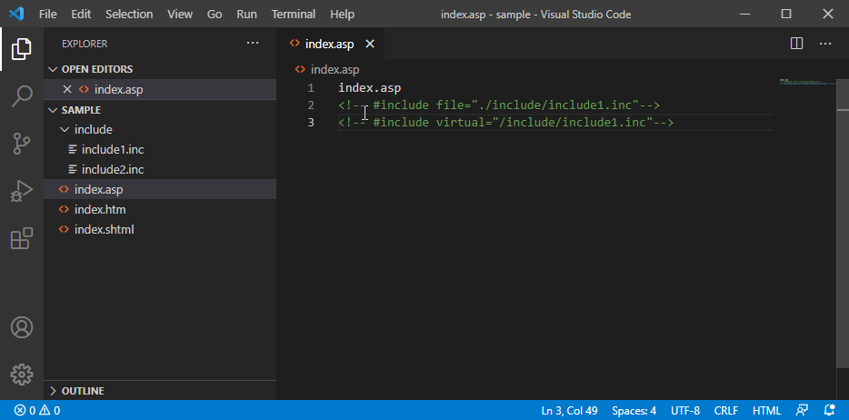

# SSI(Server Side Include) Viewer extention

This extension displays the files described by server side include tag [#include file | virtual] in an combined state.  

## Features

After installation, the following command will be added to the right-click menu.  

`Load #include`  
- Replace the [#include file | virtual] part with the specified file.

`Load #include with comment`  
- Replace with a comment so that you can know which part is replacing which file.  

> In the case of virtual, it will search for the file from the root of the workspace.  

